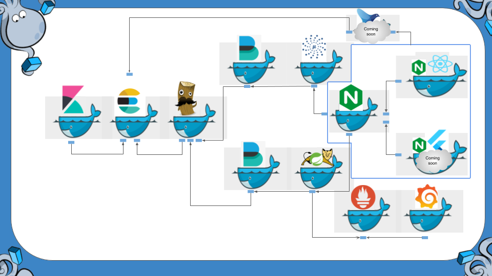

# Propósito

Mostrar como é possível fazer integração de diversas aplicações com docker/docker-composer.
(Gastei o menor termpo possível nas aplicações. Aplicações mais redondas ficaram no [projeto stock](https://github.com/Espigah/stock) )

## Integrações

* [Kibana](https://www.elastic.co/pt/products/kibana) -> [Elasticsearch](https://www.elastic.co/pt/products/elasticsearch)
* [Microunaut](https://micronaut.io/) -> [Filebeat](https://www.elastic.co/pt/products/beats/filebeat) -> [Logstash](https://www.elastic.co/pt/products/logstash) ->  [Elasticsearch](https://www.elastic.co/pt/products/elasticsearch)
* [Spring Boot 2](https://spring.io/projects/spring-boot) -> [Tomcat 8](https://tomcat.apache.org/download-80.cgi) -> [Filebeat](https://www.elastic.co/pt/products/beats/filebeat) -> [Logstash](https://www.elastic.co/pt/products/logstash) ->  [Elasticsearch](https://www.elastic.co/pt/products/elasticsearch)
* [Spring Boot 2](https://spring.io/projects/spring-boot) -> [Tomcat 8](https://tomcat.apache.org/download-80.cgi) -> [Prometheus](https://prometheus.io/)
* [Grafana](https://grafana.com/) -> [Prometheus](https://prometheus.io/)
* [React](https://pt-br.reactjs.org/)  + [NGINX](https://www.nginx.com/) -> [NGINX](https://www.nginx.com/) -> [Tomcat 8](https://tomcat.apache.org/download-80.cgi) 

# UP
    $ docker-compose up --build

# Links

Kibana -> http://localhost:5601/

Prometheus -> http://localhost:9090/

Grafana -> http://localhost:3000/

React -> http://localhost:4321/

